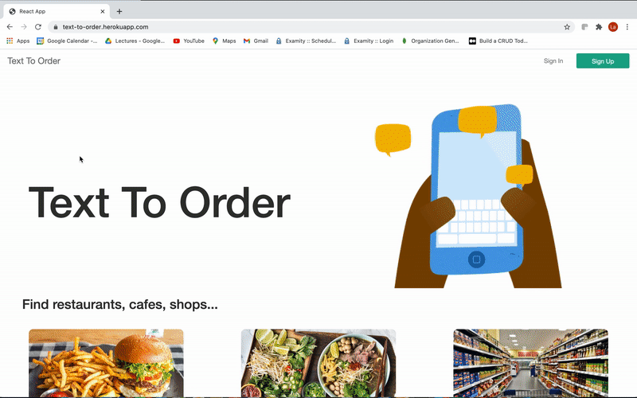

<b>Demo</b>

<i>MERN stack</i>

# Introduction
### [Live Demo](https://text-to-order.herokuapp.com//#/)

This APP let customer place orders through sms. It also has a website where merchants could edit their menu and check order history. After customer confirms order, it will collect customer's payment information using VGS Collect which sends card data to VGS reverse proxy to convert the card number and cvc to tokens. After the backend server receives the card token, it will send requests through VGS forward proxy, which reveals tokens, to 3rd party payment gateway like Stripe, Adyen...

   

## Tech Stack

React, Redux, Node.js, MongoDB, Heroku, VGS

## Features to implement:
1. optimize backend database query
2. optimize merchant dashboard
3. Checkout API to charge customer card with 3rd party API